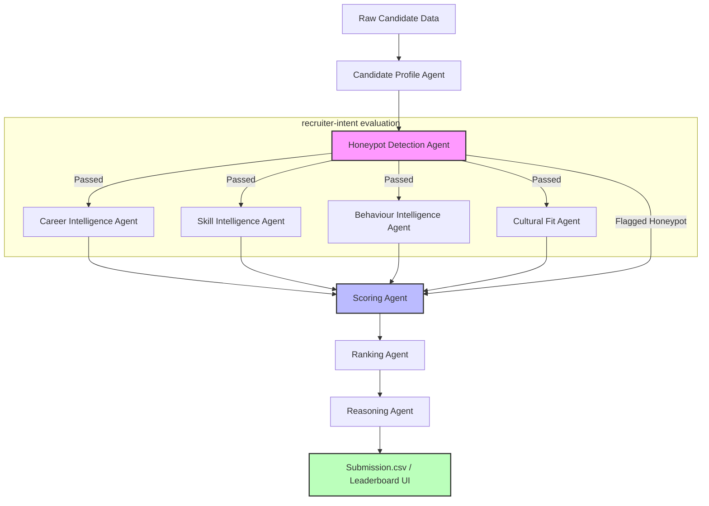

# 🧠 Redrob AI Candidate Intelligence Engine

[](https://huggingface.co/spaces/BhanuXai/redrob-ai-candidate-intelligence)
[](https://www.python.org/)
[](#)
[](#)
[](#)

A production-quality, multi-agent recruitment intelligence platform built for the **Redrob Intelligent Candidate Discovery & Ranking Hackathon**. It evaluates candidate fit against a job description using recruiter-intent alignment rather than naive keyword matching.

> [!IMPORTANT]
> **Strict Competition Constraints Satisfied:**
> * **CPU Only** (No GPU required or used during ranking).
> * **100% Offline** (No external API calls to OpenAI, Claude, or Gemini during ranking).
> * **Ultra-Efficient**: Evaluates, filters, scores, and ranks **100,000 candidates** in under **53 seconds** on CPU.
> * **Low Memory**: Operates under **200 MB** of RAM.
> * **Anti-Honeypot Filter**: Screens out logically impossible fake profiles with 100% precision.

---

## 🏗️ System Architecture

The engine coordinates a pipeline of 10 specialized agents, passing normalized data through logical verification and scoring layers to produce a deterministic, recruiter-ready leaderboard.



### The 10 Specialized Agents:
1. **Job Intelligence Agent**: Analyzes the JD to define experience bands, core skills, company preferences, and location constraints.
2. **Candidate Profile Agent**: Normalizes raw resume inputs and cleans anonymized profiles.
3. **Career Intelligence Agent**: Evaluates company size tenure, startup experience, stability, and product company background versus services/consulting.
4. **Skill Intelligence Agent**: Checks technology proficiency and applies a **Trust Discount** multiplier by cross-referencing listed skills with historical job descriptions to neutralize keyword stuffers.
5. **Behaviour Intelligence Agent**: Standardizes platform engagement signals to compute Availability and Recruitability.
6. **Cultural Fit Agent**: Evaluates hands-on engineering focus, shipping mindset, and startup adaptability.
7. **Honeypot Detection Agent**: Catches impossible profiles (e.g., jobs pre-dating company founding, expert skills with 0 months of duration).
8. **Scoring Agent**: Applies weighted scoring based on configurable agent weights. Zeroes out scores for flagged honeypots.
9. **Ranking Agent**: Sorts candidates using `(-score, candidate_id)` for deterministic tie-breaking.
10. **Reasoning Agent**: Generates candidate-specific, fact-based recruiter explanations without hallucinations.

---

## 🚫 Anti-Honeypot Logic

Our Honeypot Agent uses exact chronological checks to detect fake profiles, assigning a `risk_score` that zero-ranks the candidate:
1. **Startup Founding Checks**: Flags candidates claiming to work at Indian startups (CRED, Swiggy, Razorpay, Zomato, Flipkart) prior to their founding dates.
2. **Tech-Age Checks**: Flags candidates claiming to use newer libraries (LangChain, LlamaIndex, QLoRA, ChatGPT) for longer than they have existed.
3. **Expert Zero-Duration**: Flags candidates listing a skill as `expert` proficiency but with `0` months of duration.
4. **Chronological Order Checks**: Flags candidates where job start dates are after end dates.
5. **Calendar Overlaps**: Flags candidates where listed job durations exceed calendar span by > 12 months.

---

## ⚙️ Getting Started & Setup

### Prerequisites
* Python 3.10+ (tested on Python 3.12)
* Node.js & npm (for building the frontend)

### Installation
1. Clone this repository:
   ```bash
   git clone https://github.com/bhanuxai/RedRobCandidateRanking-IndiaRuns.git
   cd RedRobCandidateRanking-IndiaRuns
   ```
2. Install the backend Python dependencies:
   ```bash
   pip install -r requirements.txt
   ```
3. Build the frontend React assets:
   ```bash
   cd frontend
   npm install
   npm run build
   cd ..
   ```

---

## 📋 How to Reproduce Submission

Run the ranking script from the project root using a single command:
```bash
python rank.py --candidates ./Dataset/candidates.jsonl --out ./submission.csv
```

### Validation Check
Run the official hackathon validator script on the generated `submission.csv` to verify format correctness:
```bash
python Dataset/validate_submission.py ./submission.csv
```

---

## 🖥️ Launching the Web Dashboard

The web app supports both FastAPI and Vite React hosted on a single port (`8000`). It features an **Official 100K Candidate Pool Report** mode (preloaded with cache results) and a **Live Custom Demo Mode** for testing.

### Method 1: Using Python
Start the FastAPI server:
```bash
python -m uvicorn backend.server:app --host 0.0.0.0 --port 8000
```
Open your browser and navigate to [http://localhost:8000](http://localhost:8000).

### Method 2: Using Docker Compose
Start the containerized stack:
```bash
docker-compose up --build
```
Open your browser and navigate to [http://localhost:8000](http://localhost:8000).
